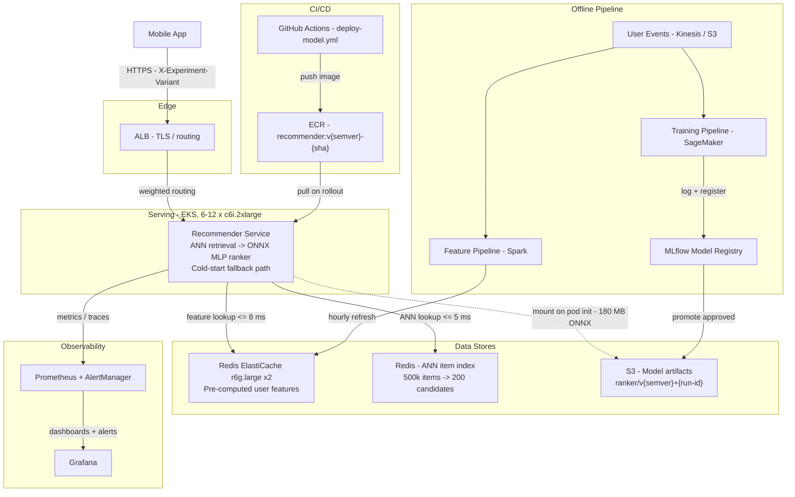

# Personalized Recommendations — MLOps Design Dossier

## Executive Summary

This repository contains the complete MLOps design for a real-time personalized
product recommendation service serving a B2C mobile retail application (Scenario X).
The system handles home-screen recommendation requests at up to 800 RPS with a
120 ms end-to-end p95 latency budget. Inference runs on a two-stage pipeline:
an approximate nearest-neighbor retrieval pass narrows ~500,000 catalog items to
a candidate set of 200, and a quantized ONNX MLP re-ranker scores and orders them
using the user's last 30 days of browsing and purchase signals. Cold-start users
(no purchase or browse history) receive popularity-ranked fallback recommendations
without touching the ranker. The serving layer runs on CPU — six c6i.2xlarge
replicas at baseline, autoscaling to twelve — because synchronous per-request
serving keeps batch sizes too small to justify GPU, and models are mounted at
runtime from S3 rather than baked into the container image, so A/B experiment
variants can be swapped without a container rebuild or redeployment.

## Architecture Diagram

## Key Numbers

| Metric | Value |
|---|---|
| Target RPS (sustained / peak) | 350 / 800 |
| Capacity sizing target | 1,000 RPS |
| p95 latency budget (SLA) | 120 ms end-to-end |
| p95 latency SLO (internal) | 100 ms |
| p99 latency SLO | 150 ms |
| Availability SLO | 99.9% |
| Error rate SLO | < 0.5% (5xx) |
| Model artifact size | ~180 MB (ONNX, quantized) |
| Hardware | c6i.2xlarge — 8 vCPU / 16 GB RAM |
| Baseline replicas | 6 |
| Max replicas (autoscale) | 12 |
| Monthly cost (baseline / full scale) | ~$2,200 / ~$3,800 |

## Navigation

| Area | Primary Artifact |
|---|---|
| Architecture | [architecture/architecture.md](architecture/architecture.md) |
| Design justification | [architecture/JUSTIFICATION.md](architecture/JUSTIFICATION.md) |
| ADR — inference hardware | [architecture/adr/0001-cpu-vs-gpu-inference.md](architecture/adr/0001-cpu-vs-gpu-inference.md) |
| ADR — model serving | [architecture/adr/0002-bake-vs-mount-model.md](architecture/adr/0002-bake-vs-mount-model.md) |
| ML lifecycle | [lifecycle/lifecycle.md](lifecycle/lifecycle.md) |
| Model registry spec | [lifecycle/model-registry.yaml](lifecycle/model-registry.yaml) |
| Dockerfile | [container/Dockerfile](container/Dockerfile) |
| Container plan | [container/README.md](container/README.md) |
| API contract | [api/openapi.yaml](api/openapi.yaml) |
| API examples | [api/examples/](api/examples/) |
| Capacity plan | [serving/capacity-plan.md](serving/capacity-plan.md) |
| SLOs | [serving/slos.yaml](serving/slos.yaml) |
| Load test plan | [serving/load-test-plan.md](serving/load-test-plan.md) |
| CI/CD pipeline | [cicd/.github/workflows/deploy-model.yml](cicd/.github/workflows/deploy-model.yml) |
| Monitoring alerts | [monitoring/alerts.yaml](monitoring/alerts.yaml) |
| Rollback runbook | [runbooks/rollback.md](runbooks/rollback.md) |

## Open Questions

1. **Feature computation point.** The latency budget assumes user features are
   pre-computed and available in Redis with sub-10 ms lookup. If any feature
   requires real-time aggregation at request time, the inference latency budget
   shrinks and the Redis tier needs redesigning. Needs confirmation from the data
   platform team before the feature store is provisioned.

2. **Cold-start definition.** The current design routes users with no 30-day
   history to a popularity-ranked fallback. "Reasonable recommendations" is the
   scenario's language — the product team needs to confirm whether item-level
   popularity is sufficient or whether contextual signals (device type, time of
   day, geo) must feed a lightweight cold-start model. The latter changes both
   the fallback path in the architecture and the API schema.

3. **A/B experiment routing ownership.** The architecture assumes experiment
   assignment is resolved upstream of this service and passed in as
   `X-Experiment-Variant`. If the experimentation platform expects the
   recommendation service to own assignment logic, both the API contract and the
   model registry's variant-routing spec need revision before any experiment
   goes live.