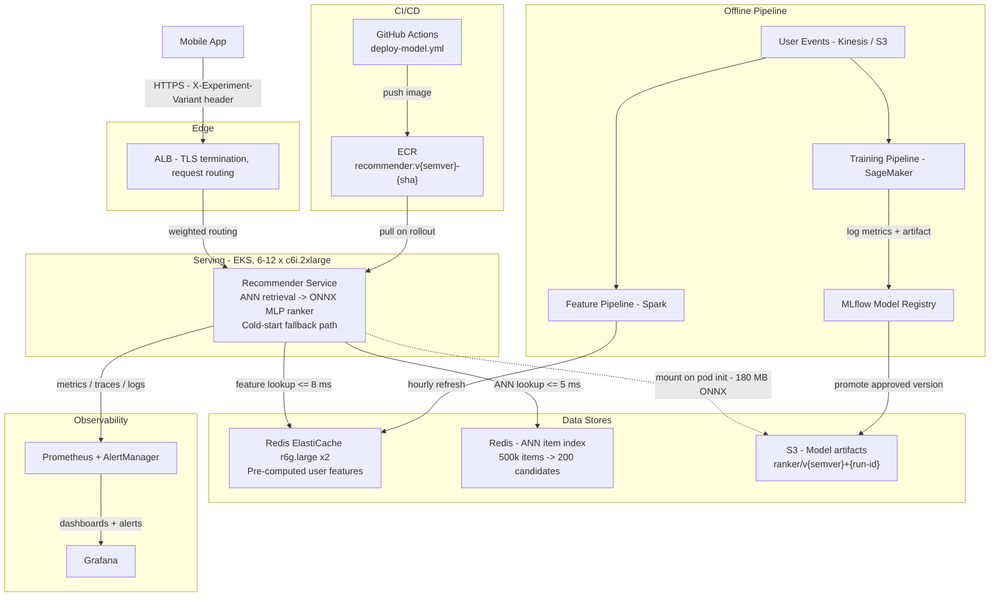

# System Architecture — Personalized Recommendations (Scenario X)

## Diagram

## Components

| Component | Technology | Role |
|---|---|---|
| Mobile App | iOS / Android | Issues `GET /v1/recommendations/{user_id}` on every home-screen load |
| ALB | AWS Application Load Balancer | TLS termination, health-check routing, forwards `X-Experiment-Variant` header |
| Recommender Service | Python 3.11, FastAPI, ONNX Runtime | ANN retrieval → ONNX MLP ranker. Cold-start fallback for users with no 30-day history |
| Redis — user features | ElastiCache r6g.large × 2 | Pre-computed user embeddings and behavioral signals, refreshed hourly. P99 lookup < 2 ms |
| Redis — ANN item index | ElastiCache (shared cluster) | Approximate nearest-neighbor index over ~500k item embeddings. Retrieval returns 200 candidates |
| S3 model artifacts | AWS S3 | Versioned ONNX artifacts mounted at pod init. Path: `s3://prod-models/ranker/v{semver}+{run-id}/model.onnx` |
| Feature Pipeline | Spark on EMR / Glue | Reads raw user events, computes embeddings and behavioral features, writes to Redis hourly |
| Training Pipeline | SageMaker Training Jobs | Full retrain on data drift signal or weekly schedule. Outputs artifact + eval metrics to MLflow |
| MLflow Model Registry | MLflow | Tracks model versions, metrics, lineage. Promotion from Staging to Production requires human sign-off and passing eval thresholds |
| ECR | AWS ECR | Stores container images tagged `recommender:v{semver}-{sha}` |
| GitHub Actions | GitHub-hosted runners | Builds, scans, pushes images; deploys to EKS via `deploy-model.yml` |
| Prometheus + AlertManager | Prometheus on EKS | Scrapes latency, error rate, model version metrics. Multi-window burn-rate alerting |
| Grafana | Grafana Cloud or self-hosted | Dashboards for latency percentiles, RPS, error rate, active model version |

## Online Request Flow

1. Mobile app makes `GET /v1/recommendations/{user_id}` with `X-Experiment-Variant` header.
2. ALB routes to a healthy Recommender Service pod.
3. Pod checks for a user feature vector in Redis.
   - **Warm user:** fetch feature vector (~8 ms), ANN retrieval over item index (~5 ms) → 200 candidates, ONNX MLP ranker (~22 ms) → top-N scored results. Total inference ~35 ms, well within the 100 ms p95 SLO.
   - **Cold-start user:** skip Redis + ANN + ranker. Return pre-computed popularity-ranked items from Redis cache. ~3 ms total.
4. Response includes `X-Model-Version` header set to the loaded model version string.
5. Pod emits a latency histogram observation and trace span to Prometheus.

## Offline Model Lifecycle

1. User events land in Kinesis, archived to S3.
2. Feature pipeline (hourly) recomputes user embeddings and writes to Redis.
3. Training pipeline (weekly or on drift signal) retrains the ranker, logs artifact + metrics to MLflow.
4. Human reviewer promotes model from `Staging` to `Production` in MLflow if eval thresholds pass.
5. CI/CD deploy job reads the promoted model's S3 path from MLflow and triggers a rolling EKS pod restart with the new `MODEL_S3_URI`.