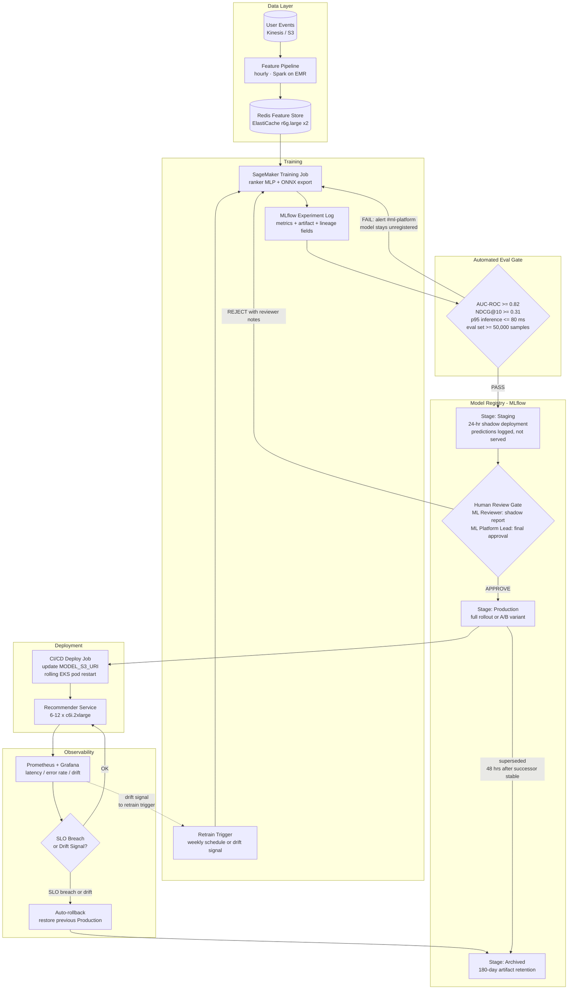

# ML Model Lifecycle — Personalized Recommendations (Scenario X)

## Diagram

## Stages

### Data

User events (impressions, clicks, purchases) land in Kinesis and are archived
to S3 within minutes. The feature pipeline runs hourly on Spark (EMR or Glue),
recomputes user embeddings and 30-day behavioral signals, and writes to the
Redis feature store. A failed feature pipeline run raises a Slack alert to
`#ml-platform` but does not halt serving — pods continue using the previous
hour's features.

### Training

Retraining is triggered in two ways: a weekly scheduled SageMaker job (every
Monday 02:00 UTC) and an on-demand trigger fired by the drift detection job
in Prometheus when the prediction distribution KL-divergence against a 7-day
baseline exceeds 0.15 for more than 30 consecutive minutes. Both paths run the
same training pipeline and log the same lineage fields to MLflow.

### Automated eval gate

The training pipeline runs the evaluation harness immediately after training.
All four conditions must pass for the model to be registered to Staging:

| Metric | Threshold | Eval set |
|---|---|---|
| AUC-ROC | >= 0.82 | Held-out last 7 days of user events, no data leakage |
| NDCG@10 | >= 0.31 | Same eval set |
| p95 inference latency | <= 80 ms | ONNX Runtime, c6i.2xlarge reference, batch=1, 10k iterations |
| Eval set size | >= 50,000 samples | Reject models evaluated on insufficient data |

A failure on any metric alerts `#ml-platform` with the failing metric and
value. The model is not registered and the training job must be rerun.

### Staging and shadow deployment

On passing the eval gate, the model is registered to MLflow `Staging` and a
24-hour shadow deployment begins automatically. In shadow mode, the model
processes every incoming request in parallel with the current Production model.
Its predictions are logged to `s3://prod-models/shadow-logs/{version}/` but
never returned to users. This generates a real-traffic evaluation dataset for
human review without any user-facing risk.

### Human review gate

The ML Reviewer reads the shadow deployment report (auto-generated after 24
hours: offline metrics vs Production baseline, latency distribution, prediction
distribution overlap). The ML Platform Lead provides final approval in the
MLflow UI. Both approvals are required before promotion. If review is not
completed within 72 hours of Staging registration, the model is auto-archived
and a Slack alert fires to `#ml-platform`.

A/B experiments require an additional artifact at this gate: an experiment plan
YAML specifying variant ID, traffic percentage, primary success metric, and
minimum sample size. Promotions without this plan when `traffic_percentage < 100`
will be rejected by the deploy job's pre-flight check.

### Production and deployment

On promotion to Production, the CI/CD deploy job reads the model artifact S3
path from the MLflow registry, validates it against the naming format
(`ranker/v{semver}+{run-id}`), sets `MODEL_S3_URI` in the EKS deployment
manifest, and initiates a rolling pod restart. Pods download the new artifact
on startup and pass their readiness probe before receiving traffic. The previous
Production model version is not archived until the new version has been stable
for 48 hours, preserving a fast rollback path.

### Monitoring and feedback loop

Prometheus scrapes latency percentiles, error rate, and model version
distribution from every pod. If the serving SLO is breached or the prediction
drift signal exceeds threshold, AlertManager fires an auto-rollback: the deploy
job restores the previous Production model version by rolling back the
`MODEL_S3_URI` to the previous registry entry. The rolled-back model version
moves to `Archived`. The drift signal that triggered the rollback is also sent
to the retrain trigger, starting a new training cycle.

## Timing reference

| Stage | Typical duration |
|---|---|
| Feature pipeline (hourly) | ~20 minutes |
| SageMaker training job | ~2–3 hours |
| Automated eval gate | ~10 minutes |
| Shadow deployment | 24 hours |
| Human review | target 24 hours, SLA 72 hours |
| Rolling pod restart (6 replicas) | ~3 minutes |
| **Total: data → live traffic** | **~28–30 hours** |